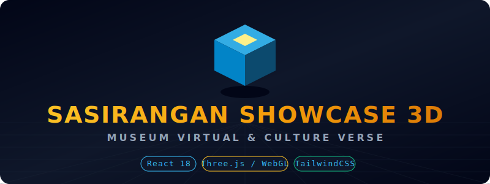

<div align="center">

# 🏛️ Sasirangan Showcase 3D — Culture Verse ✨
**Museum Virtual 3D & Eksplorasi Interaktif | SDGs Creative Web Competition — Bytesfest 2026**

[](https://reactjs.org/)
[](https://threejs.org/)
[](https://tailwindcss.com/)
[]()
[]()

<br/>

> *"Membawa kekayaan warisan budaya Sasirangan ke dalam era Metaverse melalui rekayasa WebGL tingkat tinggi."*

<br/>

<picture>
  
</picture>

</div>

---

## 🌟 Tentang Proyek

**Sasirangan Showcase 3D** adalah sebuah mahakarya front-end berupa **Museum Virtual 3D & Pengalaman Eksplorasi Interaktif** yang dirancang khusus untuk melestarikan dan mempromosikan warisan budaya **Kain Sasirangan** dari Banjarmasin, Kalimantan Selatan.

Dibangun untuk ajang **Bytesfest 2026 Creative Web Competition** di bawah payung tema **Culture Verse**, proyek ini mendukung penuh **SDG Target 11.4** *(Melindungi dan Menjaga Warisan Budaya)* dan **SDG Target 12** *(Produksi Berkelanjutan lewat Edukasi Pewarna Alami)*. Menggabungkan arsitektur galeri premium dengan pencahayaan dramatis layaknya pameran seni murni dunia.

---

## 🚀 Fitur & Inovasi Utama

### 🖼️ 1. Galeri Pameran Megah (Koridor 60 Meter)
* **Arsitektur Interior Premium:** Galeri virtual dengan lantai batu *slate* gelap yang memantulkan cahaya, pencahayaan *spotlight* sinematik, dan ornamen pameran bergaya kelas atas.
* **Pencahayaan Fisik & Refleksi (PBR):** Menggunakan *Global Illumination* dan pantulan lingkungan secara *real-time* yang membuat tekstur metalik dan bingkai lukisan terlihat nyata.

### 🕹️ 2. Kontrol Eksplorasi Imersif
* **Sistem Pointer Lock:** Klik layar untuk mengunci kursor di tengah. Gerakkan *mouse* atau usap layar HP Anda untuk memutar sudut pandang secara mulus 360 derajat.
* **Transisi Kamera Dinamis:** Beralih instan antara mode **Orang Pertama (1st-Person)** yang intim atau **Orang Ketiga (3rd-Person)** yang memperlihatkan karakter secara utuh.
* **Responsif Sempurna di Mobile:** Bermain di HP? Nikmati kontrol *On-Screen Joystick* dan layar sentuh responsif dengan adaptasi resolusi otomatis yang dijamin *anti-lag*.

### 👕 3. Kustomisasi Baju Karakter Secara Real-Time
* **Ganti Baju Sasirangan:** Dandani robot karakter Anda secara instan dengan **10 tekstur kain Sasirangan otentik**. 
* **Teknologi Kloning Tekstur:** Sistem canggih yang memastikan motif di badan dan lengan tidak merenggang (*stretching*), membuat lekukan kain terlihat sangat simetris.

### 🏆 4. Edukasi & Gamifikasi
* **Eksplorasi 5 Motif Klasik:** Pelajari sejarah di balik motif *Bayam Raja, Gigi Haruan, Kambang Kacang, Kain Sarigading*, dan *Naga Balimbur*.
* **Eco-Dye Station:** Zona interaktif khusus yang menyadarkan pengunjung akan pentingnya penggunaan bahan pewarna alami (Kunyit, Secang, Daun Mangga) untuk menjaga lingkungan (Mendukung SDG 12).
* **Sertifikat Duta Budaya:** Selesaikan eksplorasi semua lukisan untuk membuka penghargaan eksklusif di dalam sistem (tanpa menggunakan memori database!).

---

## 🛠️ Stack Teknologi (Murni Client-Side)

Proyek ini sangat mematuhi regulasi lomba (100% Statis, Zero Storage/Database):

*   **Inti Framework:** React 18, Vite, JavaScript (ES6+).
*   **Mesin 3D:** Three.js, `@react-three/fiber` (R3F), `@react-three/drei`.
*   **Mesin Fisika:** `@react-three/rapier` (WASM-based Rapier Physics Engine).
*   **Gaya Antarmuka:** Tailwind CSS dengan implementasi *Glassmorphism*.
*   **Manajemen Memori:** Zustand (RAM-only store, tanpa cookies atau *local storage*).

---

<div align="center">
  
## 💻 Panduan Instalasi Lokal

Ingin mencoba menjalankan dunia 3D ini di komputer Anda? Ikuti langkah mudah berikut:

</div>

```bash
# 1. Clone repositori ini
git clone https://github.com/codesbykhairannoor/sasiranganshowcase3d.git

# 2. Masuk ke dalam direktori proyek
cd sasiranganshowcase3d

# 3. Instal semua dependensi
npm install

# 4. Jalankan server pengembangan lokal
npm run dev
```

Buka **`http://localhost:5173`** di browser Anda dan selamat bereksplorasi!

---

<div align="center">
<i>© 2026 Sasirangan Showcase 3D — Culture Verse.<br/>Diciptakan dengan penuh dedikasi untuk SDGs Creative Web Competition.</i>
</div>
